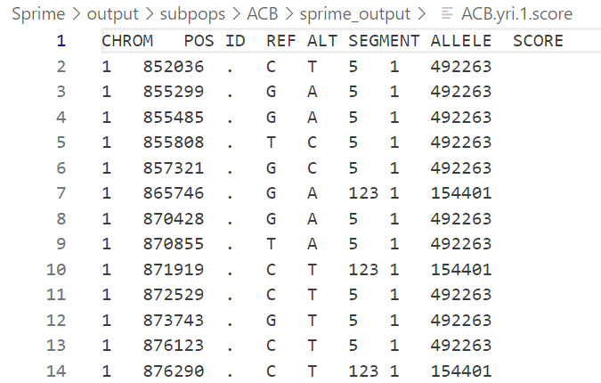
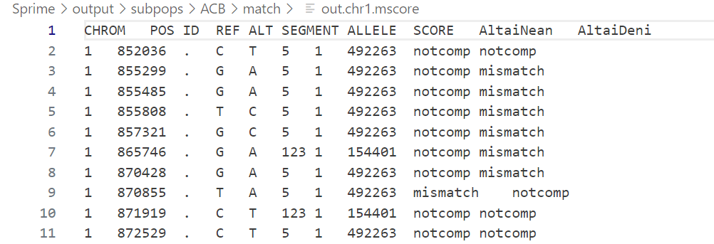

## Sprime_workflow
- 首先针对自己的集群介绍做一个简介：集群管理员尚且没有root权限只有sudo，集群也没有qsub任务提交系统所以Pipeline的脚本不能直接使用，这里是一个自建的Sprime管线。
- Sprime项目源码传送门：https://github.com/browning-lab/sprime?tab=Apache-2.0-1-ov-file
- Sprime项目Protocol传送门：https://github.com/YingZhou001/sprimepipeline
### Java环境安装和配置
- 集群管理员不提供全局安装Java服务，所以得自己从Java官网薅一个过来，网址如下：
https://download.oracle.com/java/17/archive/jdk-17.0.10_linux-aarch64_bin.tar.gz
- 通过`wget`或者在Windows上本地下载之后上传到集群，最好是在home目录新建一个文件夹保存：
```shell
    mkdir ~/java
```
- 将下载好的文件`jdk-17.0.10_linux-aarch64_bin.tar.gz`保存在`~/java`文件夹中，然后运行如下命令：
```shell
    cd ~/java
    tar -zxvf jdk-17.0.10_linux-aarch64_bin.tar.gz
    cd jdk-17.0.10_linux-aarch64_bin
```
- 将Java的安装路径添加到环境变量中：
```shell
    vi ~/.bashrc
```
- 然后在文件末尾添加：
```shell
    export JAVA_HOME=~/java/jdk-17.0.10_linux-aarch64_bin   
    export PATH=$PATH:$JAVA_HOME/bin
```
- 在终端重新刷新一遍环境变量：
```shell
    source ~/.bashrc
```

- 验证Java安装成功:
```shell
    java -version
```

### Spirme 运行脚本介绍

1. 文件夹结构：
    1. 整体结构是整个Sprime文件夹作为父文件夹，里面包含Data、output、Piprline、Samplelists和tools五个文件夹
    2. Data文件夹用于存放vcf数据和下载的map数据文件
    3. output文件夹用于存放Sprime运行的结果和产生的中间文件。
        - 如果正常运行，output文件夹会包含一个subpops文件夹和一个包含所有子群体的subgroup.txt文件，以及一个包含所有外类群个体信息的outgroup.txt文件。
        - 在subpops文件夹中，是每个子群体的结果文件夹，以每个子群体的名字命名，比如ACB，里面包含final、match、sprime_output、tmp四个结果文件夹和此群体的vcf.gz文件（22个），此群体和outgroup拼接起来的sample.txt文件还有一个提示vcf文件的`vcf.file.list`.
          - `final`文件夹中是`all.auto.vcf.gz`文件，这个是将整个群体的vcf文件拼接起来的文件，用于后续处理
        - `sprime_output`文件夹中是第2步Sprime运行的结果的`.score`文件和`log`文件,其中`.score`文件内容示例如下：
        
        - `match`文件夹是第3.5步完成后，`maparch`软件运行的结果（最终的数据结果文件），如果后续涉及到等高线图的绘制，绘制完成的等高线图也在match文件夹中，内容如下所示：
        
        - tmp文件夹中保存的是中间文件，在运行结束后应该是空文件夹
    4. Pipeline文件夹中是Sprime运行的过程中的所有shell脚本，按照文件中首个数字的顺序从小到大依次运行，当然也可以自己写一个workflow串联这些脚本
   5. tools文件夹中是后面mapping所需要使用的工具和画图的R脚本。

2. 脚本中有注释可以参考，具体脚本是干什么的可以翻译一下脚本名字。 

3. 文件和数据可以参照Sprime的Protocol,我的文件夹中只带了一个hg19版的map。

*Good Luck!*